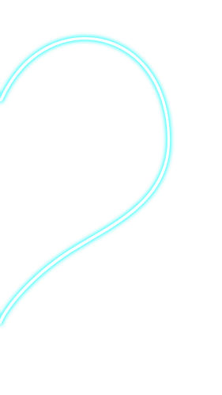
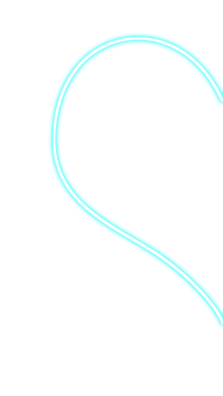

# seeyou.github.io
<!doctype html>
<html lang="en">
<head>
    <meta charset="UTF-8">
    <meta name="viewport"
          content="width=device-width, user-scalable=no, initial-scale=1.0, maximum-scale=1.0, minimum-scale=1.0">
    <meta http-equiv="X-UA-Compatible" content="ie=edge">
    <link rel="stylesheet" href="style.css">
    <title>До встречи осталось:</title>
    
</head>
<body onload="time()" style="padding: 0; margin: 0; font-family: sans-serif;">
    

        <h2 align="center">Илья Юрьевич</h1>
    

    

        <h2 align="center">Наталья Константиновна</h1>
    

    

    

        
    

    
    

        
    

</body>
</html>
